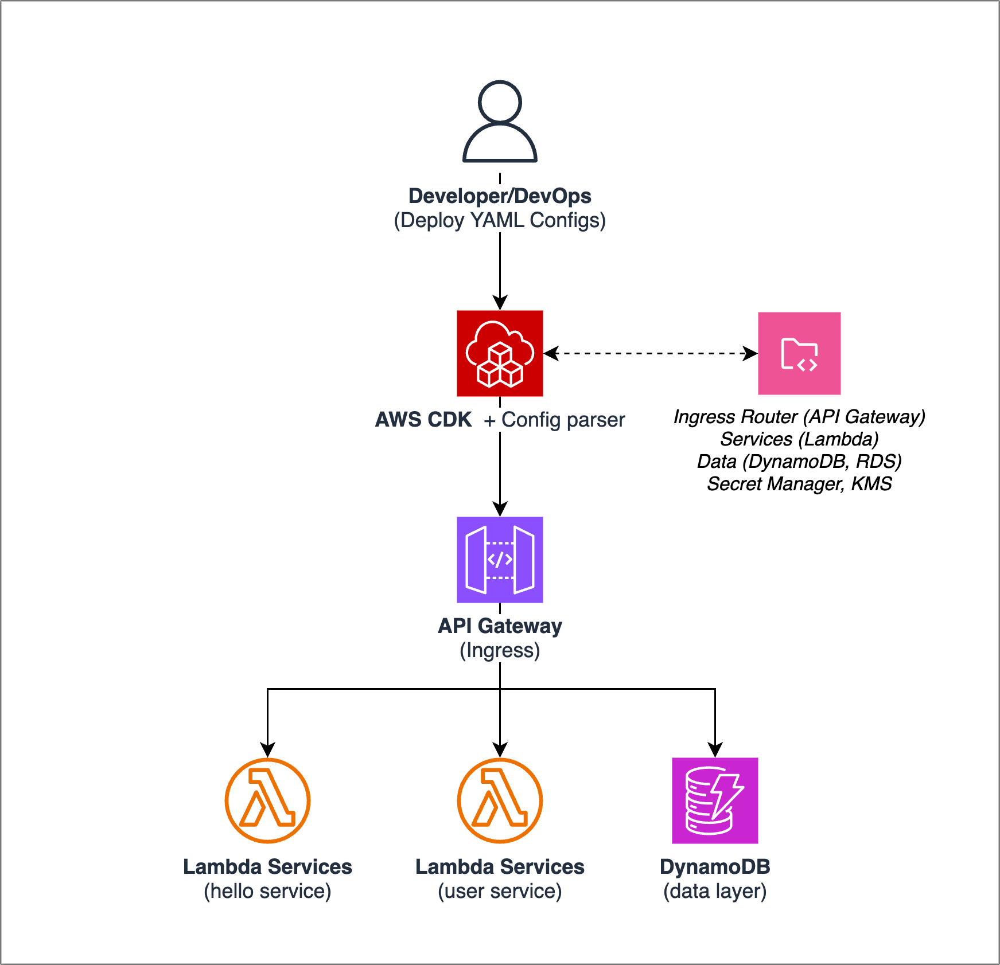

# Serverless Microservices Orchestration Framework

A production-ready, serverless microservice orchestration framework on AWS, designed to emulate key capabilities of Kubernetes but implemented with AWS-native services.

## Architecture Overview

This framework allows you to define and deploy microservices using AWS Lambda functions, with automatic exposure via API Gateway and custom domain. It uses a configuration-as-code approach similar to Kubernetes manifests, but leverages AWS-native services for implementation.



### Key Components:

- **Lambda Functions**: Core compute units (replacing Kubernetes pods)
- **API Gateway**: Service exposure and routing
- **DynamoDB/RDS/Aurora**: Data persistence options
- **Secrets Manager & KMS**: Secure secrets management
- **Route 53 & ACM**: Custom domain and HTTPS support

## Project Structure

```
serverless-microservices/
├── bin/                    # CDK app entry point and deployment scripts
│   ├── deploy.ts           # Main deployment script
│   └── validate.ts         # Configuration validator
├── config/                 # Service configuration YAML files
│   ├── api-service.yaml    # API service configuration
│   ├── hello-service.yaml  # Hello service configuration
│   └── user-service.yaml   # User service configuration
├── docs/                   # Documentation files
│   └── architecture.png    # Architecture diagram
├── ingress/                # Ingress configuration YAML files
│   └── api-ingress.yaml    # API ingress configuration
├── lib/                    # Core framework code
│   ├── config/             # Configuration parsing and validation
│   ├── constructs/         # CDK constructs for AWS resources
│   └── stacks/             # CDK stacks for service deployment
├── scripts/                # Utility scripts
│   ├── build-lambdas.js    # Lambda build script
│   ├── cleanup-resources.js # Resource cleanup script
│   └── map-custom-domain.js # Custom domain mapping script
├── src/                    # Microservice implementation code
│   ├── api-service/        # API service code
│   ├── hello-service/      # Hello service code
│   └── user-service/       # User service code
├── templates/              # Template files for new services
│   ├── ingress-template.yaml # Ingress template
│   ├── provider-template.yaml # Provider template
│   └── service-template.yaml # Service template
├── cdk.json                # CDK configuration
├── package.json            # Node.js dependencies
├── provider.yaml           # Provider configuration (created from template)
└── README.md               # Project documentation
```

## Getting Started

### Prerequisites

- AWS CLI configured with appropriate permissions
- Node.js 14+ and npm installed
- AWS CDK installed (`npm install -g aws-cdk`)

### Installation

```bash
# Clone the repository
git clone https://github.com/vuongbachdoan/micro-serverless.git

# Install dependencies
npm install

# Bootstrap CDK (first-time only)
cdk bootstrap
```

### Deployment

```bash
# Deploy all services
npm run deploy

# Clean up resources and destroy stacks
npm run destroy
```

## Configuration Reference

### Provider Configuration

The `provider.yaml` file (created from `templates/provider-template.yaml`) defines AWS-specific settings:

```yaml
provider:
  name: aws                # Cloud provider (currently only 'aws' is supported)
  region: us-east-1        # AWS region to deploy to
  sdkVersion: latest       # AWS SDK version to use
  tags:                    # Tags to apply to all resources
    Project: MyProject
    Environment: dev
    Owner: TeamName
  stackName: my-project    # Base name for CloudFormation stacks
```

All fields in the provider configuration are required:

| Parameter | Description | Required | Values |
|-----------|-------------|----------|---------|
| `name` | Cloud provider name | Yes | `aws` |
| `region` | AWS region to deploy to | Yes | `us-east-1`, `ap-southeast-1`, etc. |
| `sdkVersion` | AWS SDK version to use | Yes | `latest`, specific version |
| `tags` | Tags to apply to all resources | Yes | Key-value pairs |
| `stackName` | Base name for CloudFormation stacks | Yes | Any valid stack name |

The `stackName` parameter is used as a prefix for all stacks created by the framework. For example, if `stackName` is set to `my-project`, service stacks will be named `my-project-service-name` and ingress stacks will be named `my-project-ingress-name-ingress`.

### Service Configuration

Service configurations are defined in YAML files in the `config/` directory. Here are examples for the three main service types:

#### 1. Basic Lambda with API Gateway

```yaml
service:
  name: hello-service
  runtime: nodejs18.x
  handler: index.handler
  memory: 256
  timeout: 30
  
  api:
    path: /hello
    method: GET
    public: true
    cors: true
    
  environment:
    STAGE: dev
    LOG_LEVEL: info
    
  secrets:
    - name: API_KEY
      secretId: hello-service/api-key
```

#### 2. Lambda with DynamoDB

```yaml
service:
  name: user-service
  runtime: nodejs18.x
  handler: index.handler
  memory: 512
  timeout: 30
  
  api:
    path: /users
    method: ANY
    public: true
    cors: true
    
  environment:
    STAGE: dev
    LOG_LEVEL: info
    
  dynamodb:
    - name: UsersTable
      partitionKey: userId
      sortKey: email
      ttl: expiresAt
      billingMode: PAY_PER_REQUEST
      globalSecondaryIndexes:
        - name: EmailIndex
          partitionKey: email
        - name: StatusIndex
          partitionKey: status
          sortKey: createdAt
```

#### 3. Lambda with VPC and RDS

```yaml
service:
  name: orders-service
  runtime: nodejs18.x
  handler: index.handler
  memory: 1024
  timeout: 60
  
  api:
    path: /orders
    method: ANY
    public: true
    cors: true
    
  environment:
    STAGE: dev
    LOG_LEVEL: info
    
  vpc:
    id: vpc-12345678
    subnets:
      - subnet-12345678
      - subnet-87654321
    securityGroups:
      - sg-12345678
      
  rds:
    instance: orders-db
    engine: postgres
    secrets:
      - name: DB_CONNECTION
        secretId: orders-service/db-connection
```

### Ingress Configuration

Ingress configurations are defined in YAML files in the `ingress/` directory:

```yaml
ingress:
  name: api-ingress
  annotations:
    route53.hostedZoneId: Z00976892A2KHU6N0F7PT
    domain.existing: "true"
  tls:
    - hosts:
        - sample.domain.com
      certificateArn: arn:aws:acm:us-east-1:123456789012:certificate/abcdef
  rules:
    - host: sample.domain.com
      http:
        paths:
          - path: /hello
            pathType: Prefix
            backend:
              service:
                name: hello-service
          - path: /users
            pathType: Prefix
            backend:
              service:
                name: user-service
```

## Scripts

### Deployment

```bash
# Build and deploy all services
npm run deploy

# Deploy a specific service
npm run deploy -- --service=hello-service

# Deploy a specific ingress
npm run deploy -- --ingress=api-ingress
```

### Cleanup and Destroy

```bash
# Clean up resources and destroy all stacks
npm run destroy
```

The `destroy` script:
1. Cleans up resources that might block stack deletion (like API Gateway base path mappings)
2. Deletes DynamoDB tables defined in service configurations
3. Runs `cdk destroy --all` to remove all CloudFormation stacks

## Security Best Practices

- All secrets are stored in AWS Secrets Manager and encrypted with KMS
- Each service has its own IAM role with least-privilege permissions
- API endpoints can be marked as public or private
- All communications use HTTPS

## Troubleshooting

### Custom Domain Issues

If you're experiencing issues with custom domain resolution:

1. **DNS Propagation**: DNS changes can take up to 48 hours to fully propagate globally. Try accessing your API using the direct API Gateway URL while waiting.

2. **Verify DNS Records**: Check that the Route 53 record has been created correctly:
   ```bash
   aws route53 list-resource-record-sets --hosted-zone-id YOUR_HOSTED_ZONE_ID --query "ResourceRecordSets[?Name=='sample.domain.com.']"
   ```

3. **Check API Gateway Custom Domain**: Verify the custom domain is properly set up in API Gateway:
   ```bash
   aws apigateway get-domain-name --domain-name sample.domain.com
   ```

4. **Verify Base Path Mappings**: Ensure the base path mapping exists:
   ```bash
   aws apigateway get-base-path-mappings --domain-name sample.domain.com
   ```

5. **Use Direct API URL**: Access your API directly using the API Gateway URL. First, find your stack name (which includes the prefix from provider.yaml):
   ```bash
   aws cloudformation list-stacks --query "StackSummaries[?contains(StackName,'ingress')].StackName" --output text
   ```
   
   Then get the API URL:
   ```bash
   aws cloudformation describe-stacks --stack-name YOUR_STACK_NAME --query "Stacks[0].Outputs[?contains(OutputKey,'ApiUrl')].OutputValue" --output text
   ```

### Stack Name Issues

If you can't find your CloudFormation stack:

1. **Check Stack Naming**: Remember that your stacks are prefixed with the `stackName` from your provider.yaml file. For example, if your stackName is `my-project`, your ingress stack would be named `my-project-api-ingress-ingress`.

2. **List All Stacks**: To see all your stacks:
   ```bash
   aws cloudformation list-stacks --stack-status-filter CREATE_COMPLETE UPDATE_COMPLETE --query "StackSummaries[].StackName" --output text
   ```

## License

This project is licensed under the MIT License - see the LICENSE file for details.